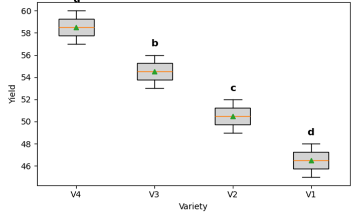

# Summary

AgroDesign provides an interface for describing experimental designs,
fitting ANOVA models, and summarizing comparisons. Its coverage ranges
from common agronomic studies, which might involve field plots or
greenhouse studies, to any other biological studies requiring block or
split-plot designs. The package integrates with the scientific Python
ecosystem (NumPy, pandas, and statsmodels) while adding a design-aware
analysis layer tailored to agricultural and biological studies. In
addition, the package performs assumption tests, including failure of
normality of residuals and homogeneity of variance, and treatment group
comparisons. AgroDesign generates decision-oriented summaries and
figures commonly required in agronomic reporting. Support for grouped
analyses and multiple response variables enables evaluation of
multi-year or multi-trait experiments within a consistent framework.

# Statement of Need

Agronomic and biological experiments often use experimental designs like
randomized block designs, factorial arrangements, split-plot layouts,
and multi-environment trials to assess the treatment effects on yield,
quality, or any other physiological characteristics. Analysis of such
experiments does not require fitting linear models only, but also
selecting appropriate error terms, performing treatment mean separation,
and reporting the outputs in an interpretable form for decision making.

In practice, performing this workflow within Python requires combining
different libraries and defining the statistical models. While this is
error-prone, difficult to teach, and often results in mixed use of
software within different programming environments, using a single
interface which natively incorporates the structure of experimental
designs can benefit the reproducibility of experimental data analysis.
AgroDesign is a tool that meets this need with a design-aware analytical
interface that links experimental layout specification, statistical
inference, and agronomic interpretation under a single Python workflow.

# State of the Field

In agricultural research, the R package agricolae provides tools for
experimental designs and mean separation procedures tailored to field
trials [@demendiburu2021]. Similarly, commercial and academic software
like Genstat, SAS, and JMP also offer comprehensive DOE modules for
agronomy (though outside the open-source Python ecosystem). In contrast,
Python statistical libraries are fragmented. For example, statsmodels
provides general linear modeling and ANOVA [@seabold2010],
but are limited as the data models require manual model specification
and exclude experimental design structure and agronomic interpretation.
Scipy offers basic statistical tests [@virtanen2020], and
scikit-posthocs [@terpilowski2019] provides multiple comparison
procedures but are independent of experimental layouts.
Design-generation of libraries like pyDOE3 [@pydoe3] focus on
constructing experimental plans rather than analyzing the agricultural
trials.
Hence, researchers often resort to the use of manual scripting and/or
mixed R-Python workflows to analyze designed experiments. AgroDesign
fills this specific research need by developing an interface to unify
experimental design specification, ANOVA modeling, and separation and
interpretation, all within a single Python workflow.

# Software design

AgroDesign is implemented as a domain-specific analytical interface
rather than a general statistical modeling library. Instead of requiring
users to write statistical formulas, the software encodes experimental
design structure directly and derives the appropriate statistical model
from the declared layout.
Internally, the package separates responsibilities between three
conceptual components: a design interface that captures the experimental
structure, a statistical backend that performs model estimation using
established scientific Python libraries, and an interpretation layer
that converts statistical results into agronomic decisions. As shown in \autoref{fig:workflow}, AgroDesign converts experimental design specification directly into statistical analysis and interpretation.

Model estimation relies on validated numerical libraries, primarily
statsmodels for linear modeling and scipy for statistical tests.
AgroDesign therefore focuses on correct specification of error strata,
treatment comparisons, and decision-oriented reporting rather than
re-implementing statistical algorithms. This design allows the software
to maintain statistical correctness while providing an interface aligned
with terminology used in agricultural and biological experimentation.

# Functionality

AgroDesign's primary features are:

- **Experimental Designs:** Supports CRD, RCBD, factorial designs,
split-plot designs with nested whole- and sub-plot factors, and
genotype-by-environment (G×E) two-factor designs. Future releases will
extend to more complex layouts like strip-plot designs.

- **Post-hoc Tests:** Fisher\'s LSD procedure, as well as Tukey\'s HSD
with grouping letters, are all provided with easy extension of any ANOVA
procedure.

- **Grouped & Multi-trait Analysis:** Enables the analysis of repeated
data, such as those from a multi-site study or even several response
variables. Results from a grouped ANOVA table are shown for all the
groups; letters are also displayed within the blocks/trait.

- **Automatic Error Term Selection:** For a nested design (e.g., split
plot), AgroDesign can automatically detect which error term to select
for each factor. The user doesn't have to select which sub-plot and
which whole-plot error to use.

- **Assumption Diagnostics:** This component allows users to run the
Shapiro-Wilk test on residual normality, Bartlett or Levene tests on
homoscedasticity, as well as plot residual and QQ plots to check
residual assumptions.

- **Plotting:** Allows for the generation of journal-ready plots of
treatment means with error bars, including annotated grouping letters
from post-hoc tests. The plots can be exported as Matplotlib objects or
files.

# Example 

AgroDesign is designed to provide a concise workflow from experimental
data to agronomic interpretation. The following example demonstrates
analysis of a RCBD dataset included with the package:

```python
from agrodesign import Experiment
from agrodesign.datasets import load_dataset

df = load_dataset("rcbd")
result = Experiment(df, "Yield").rcbd("Variety", "Block").run()
print(result)
```

The command returns a concise scientific snapshot:

AgroResult (RCBD)

Response: Yield

Significant factors: Treatment

Best treatment: T3

Expected yield: 5.42

A full statistical report, including ANOVA table, mean separation, and
assumption diagnostics, can be obtained using `print(result)`. The
agronomic recommendation can be printed directly using `result.summary()`.
Similarly, plots suitable for reports or publications are generated
automatically using `result.plot()` as shown in \autoref{fig:rcbd}.



AgroDesign uses a uniform interface across experimental layouts. For
example, grouped analyses such as multi-year trials can be evaluated
with a single command:

from agrodesign import Experiment
from agrodesign.datasets import load_dataset

```python
df = load_dataset("grouped")
result = Experiment(df, "Yield").by("Year").rcbd("Treatment", "Block").run()
print(result)
```
This produces a combined decision summary across environments. The
package emphasizes interpretable outputs alongside statistical tables;
the results are thus easily understandable by agronomists and biological
researchers alike.

# Limitations and future direction

AgroDesign centres on standard analysis of variance-based experimental
design. Consequently, it will not apply to all forms of statistical
modeling. AgroDesign assumes balanced or near-balanced experimental
design data. It does not assure optimal statistical inference on highly
unbalanced observational studies. Mixed models and
genotype-by-environment studies are supported. Yet, interpretability is
prioritized over generality. Advanced covariance structures, spatial
models, Bayesian models, and generalized linear mixed models are outside
the current scope and remain better handled by specialized statistical
frameworks. They are included in other statistical environments. For its
calculations, AgroDesign uses scientific Python modules. It does not
feature all types of statistical analysis allowed within those
dependencies. AgroDesign does not feature a comprehensive statistical
environment. It offers a domain-oriented interface to standard
experimental designs.

The future development of AgroDesign will be extended in three areas:

1.  Additional experimental designs in the layout will be implemented,
    especially in the strip plot, Latin square, and augmented designs.
    Spatial analysis and heterogeneous error variance structures will be
    included in the support to address modern multi-location designs.

2.  There are plans to improve interoperability features like
    standardized export of reports, notebook-based material for
    teaching, and integration with reproducible resources. There are
    plans to enrich data library resources and tutorials.

3.  There will be enhancements made to decision-oriented features like
    stability metrics, the selection of multi-objective traits, and
    methods for genotype recommendations in plant breeding programs.
    These changes will continue to improve the strength of AgroDesign
    both as a tool in research and teaching in experimental science.

# Conclusion

AgroDesign provides aunified Python interface for the analysis of
designed experiments commonly used in agricultural and biological
research. This package simplifies the process, starting from
experimental structure specification, followed by statistical analysis,
and ending with agronomic interpretation of a process otherwise
fragmented across different tools. Complementing general statistical
libraries, it does not replace basic modeling frameworks but rather
focuses on domain-specific usability and reproducibility. Through its
design-driven interface and interpretable outputs, AgroDesign allows
researchers and students to perform statistically correct analyses while
underlining scientific conclusions. AgroDesign is an open-source
infrastructure for reproducible experimental science, wherein complete
analyses can be executed transparently, shared, and extended. In this
regard, the package works as both a practical analytical tool and a
basis for future methodological development in experimental data
analysis.

# AI usage disclosure

Generative AI tools were used to assist with language editing,
organisation of manuscript text, and drafting of documentation examples.
The software implementation, statistical methodology, experimental
design logic, and validation of results were performed entirely by the
authors. All AI-assisted text was carefully reviewed, corrected, and
verified against the implemented code and statistical references to
ensure accuracy and consistency.